# Docmost K3s Infrastructure


Инфраструктурный DevOps-проект по автоматизации развертывания, мониторинга и сопровождения платформы **Docmost** в Kubernetes-кластере **K3s**.

Проект демонстрирует полный цикл эксплуатации приложения: подготовку окружения, создание кластера, установку runner'а, сборку и доставку изменений через CI/CD, деплой через Helm, наблюдаемость, логирование и алертинг.

---

# Содержание

- [О проекте](#о-проекте)
- [Архитектура решения](#архитектура-решения)
- [Используемый стек](#используемый-стек)
- [CI/CD Pipeline](#cicd-pipeline)
- [Структура проекта](#структура-проекта)
- [Развертывание](#развертывание)
- [Результаты](#результаты)
- [Практики и подходы](#практики-и-подходы)

---

# О проекте

Проект представляет собой полноценную инфраструктурную платформу для размещения и сопровождения приложения **Docmost** в Kubernetes-кластере. В рамках проекта реализован полный цикл эксплуатации приложения: подготовка среды, управление конфигурацией, автоматическая доставка изменений, мониторинг состояния сервисов, централизованный сбор логов и обработка инцидентов. Особое внимание уделено воспроизводимости инфраструктуры, минимизации ручных операций и использованию подходов, применяемых в реальных production-средах.

Проект охватывает не только развёртывание самого приложения, но и всю сопутствующую экосистему, необходимую для его стабильной эксплуатации. Реализованы механизмы непрерывной доставки изменений, контроль состояния кластера и приложений, визуализация ключевых метрик, централизованное хранение логов, автоматическое обнаружение проблем и уведомление о возникающих инцидентах. Такой подход позволяет получить полностью управляемую и наблюдаемую инфраструктуру, готовую к дальнейшему развитию и масштабированию.

[](https://github.com/docmost/docmost)

[](https://docmost.com/docs)

---

# Архитектура решения

<p align="center">
  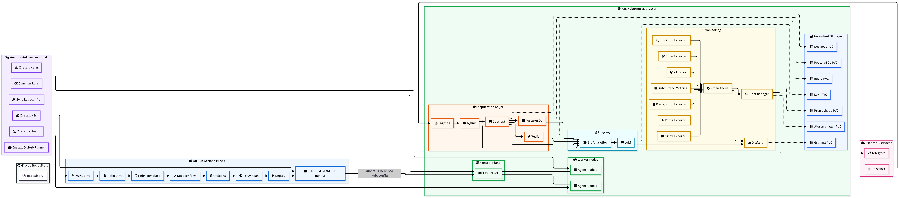
</p>

### Поток работы системы

1. Ansible подготавливает инфраструктуру и разворачивает Kubernetes-кластер на базе K3s.
2. На отдельной виртуальной машине настраивается GitHub Self-Hosted Runner для выполнения CI/CD задач.
3. Разработчик вносит изменения в Helm Chart, конфигурацию приложения или инфраструктурный код и отправляет их в GitHub-репозиторий.
4. GitHub Actions автоматически запускает pipeline после нового коммита в репозиторий.
5. Pipeline выполняет проверки качества конфигурации и валидацию Helm Chart.
6. Trivy анализирует Kubernetes-манифесты и выявляет потенциальные проблемы безопасности и нарушения security best practices.
7. После успешного прохождения проверок GitHub Actions передаёт задачу на Self-Hosted Runner.
8. Runner подключается к Kubernetes-кластеру и выполняет обновление релиза через Helm.
9. K3s выполняет rollout изменений и приводит состояние кластера к описанному в Helm Chart.
10. Prometheus начинает собирать метрики узлов, контейнеров, Kubernetes-компонентов и приложений.
11. Alloy собирает логи со всех узлов кластера и передаёт их в Loki для централизованного хранения.
12. Grafana предоставляет единый интерфейс для анализа метрик, логов и состояния инфраструктуры.
13. Alertmanager отслеживает срабатывание правил мониторинга и отправляет уведомления о проблемах и восстановлении сервисов.

---

# Используемый стек

<p align="center">
  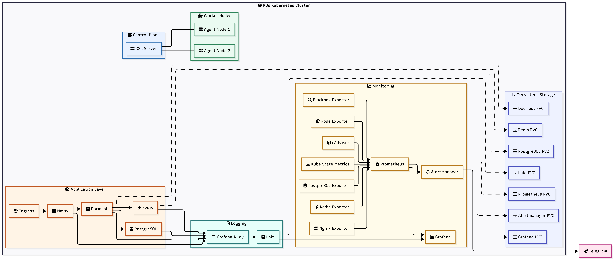
</p>

### Основные компоненты

* **K3s** — лёгкий Kubernetes-кластер для размещения приложений и инфраструктурных сервисов
* **Helm** — управление релизами и шаблонизация Kubernetes-манифестов
* **Ansible** — автоматизация подготовки серверов, развёртывания кластера и настройки GitHub Runner
* **GitHub Actions** — CI/CD pipeline для проверки и доставки изменений
* **GitHub Self-Hosted Runner** — выполнение deployment-задач внутри инфраструктуры
* **Vagrant** — воспроизводимое локальное тестовое окружение
* **Prometheus** — сбор и хранение метрик
* **Grafana** — визуализация метрик, логов и состояния инфраструктуры
* **Loki** — централизованное хранение логов
* **Alloy** — сбор и доставка логов в Loki
* **Alertmanager** — маршрутизация и отправка уведомлений
* **Trivy** — security-анализ Kubernetes-манифестов и Helm Chart
* **Ingress** — публикация сервисов внутри Kubernetes-кластера
* **Persistent Volumes (PVC)** — постоянное хранение данных приложений
* **Blackbox Exporter** — проверка доступности сервисов и HTTP-эндпоинтов
* **Node Exporter** — метрики операционной системы и аппаратных ресурсов узлов
* **cAdvisor** — мониторинг контейнеров и потребления ресурсов
* **kube-state-metrics** — метрики состояния объектов Kubernetes
* **PostgreSQL Exporter** — мониторинг базы данных PostgreSQL
* **Redis Exporter** — мониторинг Redis
* **Nginx Exporter** — мониторинг Nginx
* **Docmost** — платформа управления документацией и базой знаний
* **PostgreSQL** — основная база данных приложения
* **Redis** — кэширование и фоновые задачи приложения
* **Nginx** — reverse proxy и точка входа в приложение

---

# CI/CD Pipeline

<p align="center">
  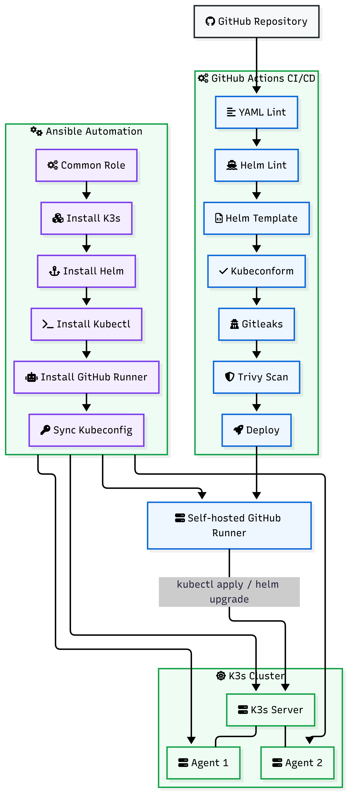
</p>

### Что делает pipeline

- валидирует Helm Chart перед развертыванием
- проверяет корректность Kubernetes-манифестов
- выполняет security-сканирование конфигурации через Trivy
- контролирует соответствие Kubernetes Security Best Practices
- предотвращает применение некорректных или небезопасных изменений
- запускает процесс доставки через GitHub Self-Hosted Runner
- выполняет обновление релиза в K3s-кластере через Helm
- автоматически применяет изменения к приложению и компонентам мониторинга
- обеспечивает единый процесс CI/CD для всех инфраструктурных изменений

---

# Структура проекта

<details open>
<summary><strong>Показать структуру проекта</strong></summary>

```text
.
├── README.md                                   # Документация проекта
│
├── Vagrantfile                                 # Виртуальная машина GitHub Self-Hosted Runner
│                                                Используется CI/CD pipeline для выполнения деплоя
│                                                в Kubernetes-кластер
│
├── assets                                      # Скриншоты, схемы архитектуры,
│   └── ...                                     # дашборды и результаты работы проекта
│
├── ansible                                     # Автоматизация подготовки инфраструктуры
│   ├── ansible.cfg                             # Конфигурация Ansible
│   ├── group_vars                              # Общие переменные проекта
│   ├── inventory                               # Инвентарь серверов
│   ├── playbooks                               # Сценарии развертывания
│   │   ├── k3s-cluster.yml                     # Развёртывание Kubernetes-кластера
│   │   ├── setup-runner.yml                    # Настройка GitHub Self-Hosted Runner
│   │   └── sync-kubeconfig.yml                 # Получение kubeconfig
│   │
│   └── roles                                   # Роли для настройки узлов кластера
│       ├── common                              # Базовая подготовка всех серверов
│       ├── k3s-server                          # Настройка Control Plane
│       ├── k3s-agent                           # Настройка Worker Nodes
│       └── k3s-runner                          # Настройка GitHub Runner
│
├── helm_docmost                                # Собственный Helm Chart
│   ├── Chart.yaml                              # Описание чарта
│   ├── values.yaml                             # Основные параметры конфигурации
│   ├── trivy.yaml                              # Исключения для security-сканирования
│   │
│   ├── templates                              # Kubernetes-манифесты Helm
│   │   ├── apps                               # Приложение и зависимые сервисы
│   │   │   ├── docmost
│   │   │   ├── nginx
│   │   │   ├── postgres
│   │   │   └── redis
│   │   │
│   │   ├── monitoring                         # Полный стек наблюдаемости
│   │   │   ├── prometheus
│   │   │   ├── grafana
│   │   │   ├── loki
│   │   │   ├── alertmanager
│   │   │   └── exporters
│   │   │
│   │   ├── networking                         # Namespace и Ingress
│   │   ├── storage                            # Persistent Volume Claims
│   │   └── secrets                            # Kubernetes Secrets
│   │
│   └── dashboards                             # Grafana Dashboard as Code
│
├── .github
│   └── workflows
│       └── deployk3s.yml                       # CI/CD pipeline:
│                                                 lint → security checks →
│                                                 helm validation →
│                                                 deployment в K3s
│
└── vagrant
    └── Vagrantfile                             # Kubernetes-стенд для тестирования
│                                                Создаёт виртуальные машины
│                                                K3s Server и Worker Nodes
│                                                для локального воспроизведения
│                                                production-подобной среды
```

</details>

---

# Развертывание

Инфраструктура состоит из двух частей:

* **Vagrantfile в корне проекта** — виртуальная машина для GitHub Self-Hosted Runner.
* **Vagrantfile в директории `vagrant/`** — виртуальные машины Kubernetes-кластера (K3s Server и Worker Nodes).

После создания виртуальных машин на них устанавливаются только базовые компоненты:

* K3s
* Helm
* GitHub Actions Runner

Развертывание приложения, мониторинга и логирования выполняется исключительно через CI/CD pipeline.

### Создание тестового окружения

Сначала поднимается виртуальная машина для GitHub Runner:

```bash
vagrant up
```

Затем создаются виртуальные машины Kubernetes-кластера:

```bash
cd vagrant

vagrant up
```

### Подготовка Kubernetes-кластера

После запуска виртуальных машин выполняется настройка инфраструктуры через Ansible.

Разворачивается кластер K3s, устанавливается Self-Hosted Runner и синхронизируется kubeconfig для дальнейшей работы с Kubernetes.

```bash
cd ansible

ansible-playbook -i inventory/dev/hosts.ini playbooks/k3s-cluster.yml
ansible-playbook -i inventory/dev/hosts.ini playbooks/setup-runner.yml
ansible-playbook -i inventory/dev/hosts.ini playbooks/sync-kubeconfig.yml
```

### Автоматический деплой приложения

Основным способом доставки изменений является CI/CD pipeline.

После отправки изменений в репозиторий запускается workflow `deployk3s.yml`, который выполняет проверки Helm Chart, security-сканирование, валидацию конфигурации и развёртывает приложение в K3s-кластере через GitHub Self-Hosted Runner.

```bash
git add .
git commit -m "Update infrastructure"
git push origin main
```

После успешного прохождения всех этапов CI/CD pipeline Helm обновляет релиз в K3s-кластере и выполняет rollout изменений.

В результате Kubernetes автоматически создаёт и поддерживает в актуальном состоянии приложение, базы данных, систему мониторинга, централизованное логирование и компоненты алертинга, необходимые для эксплуатации платформы.

<p align="center">
  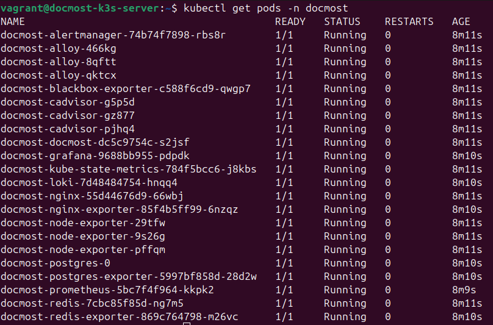
</p>

---

# Результаты

## Мониторинг инфраструктуры

Отображение состояния серверов, загрузки процессора, памяти, дисковой подсистемы и сетевой активности.

<p align="center">
  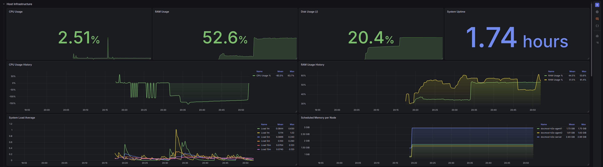
</p>

---

## Мониторинг Kubernetes-кластера

Контроль состояния нод, подов и основных компонентов K3s-кластера.

<p align="center">
  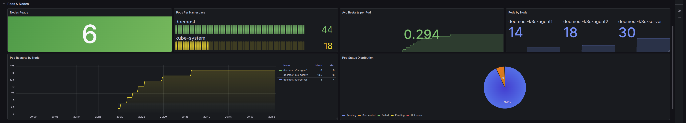
</p>

---

## Мониторинг приложений

Метрики Docmost, PostgreSQL, Redis, Nginx и других сервисов, развёрнутых в кластере.

<p align="center">
  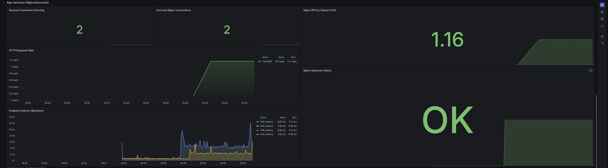
</p>

---

## Централизованное логирование

Сбор и агрегация логов приложений и инфраструктурных компонентов через Loki и Alloy.

<p align="center">
  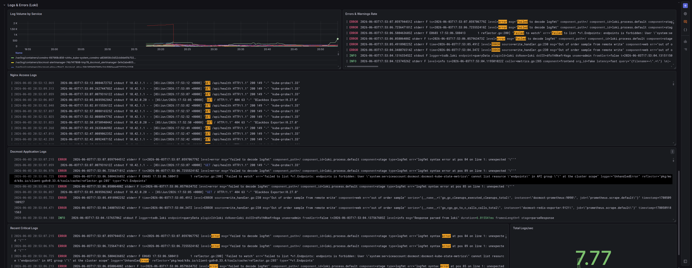
</p>

---

## CI/CD Pipeline

Автоматическая доставка изменений от коммита до обновления приложения в Kubernetes-кластере.

<p align="center">
  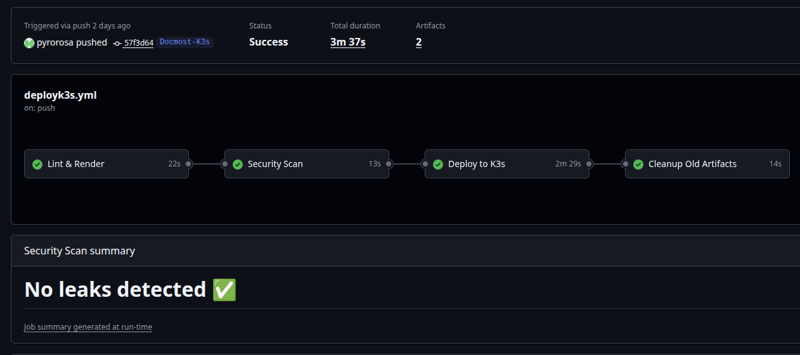
</p>

---

## CI/CD Notifications

Демонстрация уведомлений GitHub Actions о ходе выполнения CI/CD pipeline:

- результат выполнения deployment job
- информация о репозитории и ветке запуска
- сведения о коммите и авторе изменений
- ссылка на workflow для диагностики ошибок

<p align="center">
  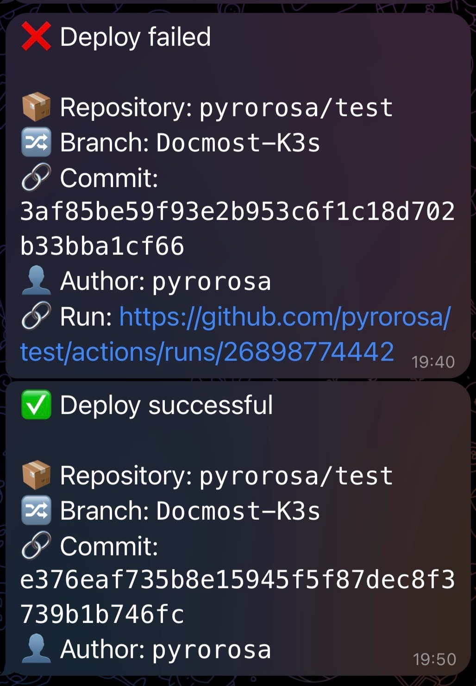
</p>

---

## Alertmanager Alerts

Демонстрация уведомлений системы мониторинга при возникновении инцидентов:

- недоступность сервисов и контейнеров
- отказ PostgreSQL и Redis
- недоступность HTTP-эндпоинтов
- превышение порогов использования CPU
- превышение порогов использования памяти
- нехватка свободного места на диске
- уведомления о восстановлении сервисов после сбоя

<p align="center">
  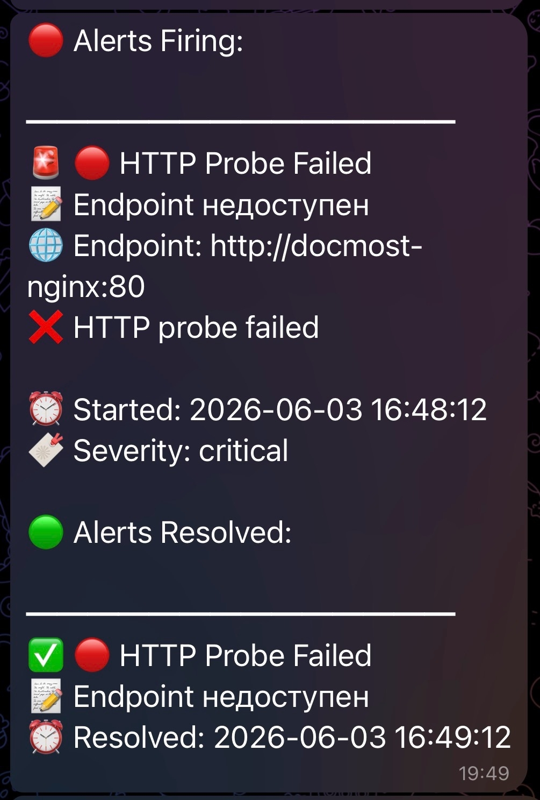
</p>

# Практики и подходы

- Infrastructure as Code (IaC)
- Configuration Management
- Automated Infrastructure Provisioning
- Kubernetes Orchestration
- Helm Chart Development
- CI/CD Automation
- Self-Hosted GitHub Runner
- Security Scanning
- Infrastructure Monitoring
- Centralized Logging
- Alerting & Incident Response
- Observability (Metrics + Logs + Alerts)
- Reproducible Environments
